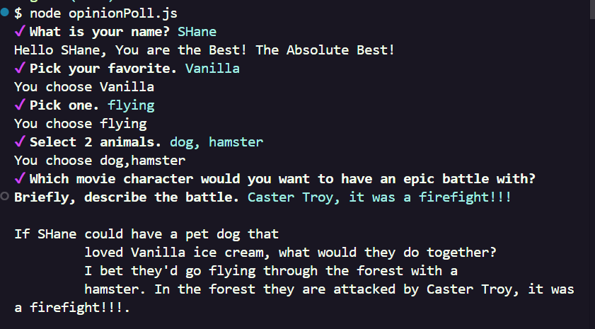

# command-line-program

This is a command-line opinion poll that asks you a few questions and then displays a funny Ad-Lib using your responses. There is a checkbox question, select questions and input questions. 

## Project Setup
- First, create a repository. Make sure to add .gitignore.
- Now I need to navigate into my project's terminal and run:

            npm init

- Add "type": "module" to the package.json file. This allows me to use es6 style imports.
- Install Inquirer -
    - go to: <https://www.npmjs.com/package/@inquirer/prompts>
    - there it will tell you to run this command:

            npm install @inquirer/prompts

- Create the prompts for the opinion poll. Reference the documentation for format of the different types of prompts that can be used. 
- After, making the prompts, you can run the opinion poll buy running the following command in the terminal:

            node opinionPoll.js

## Example Output:

